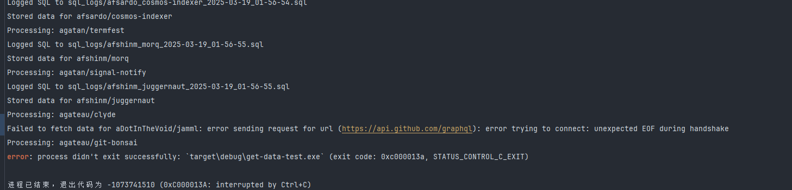
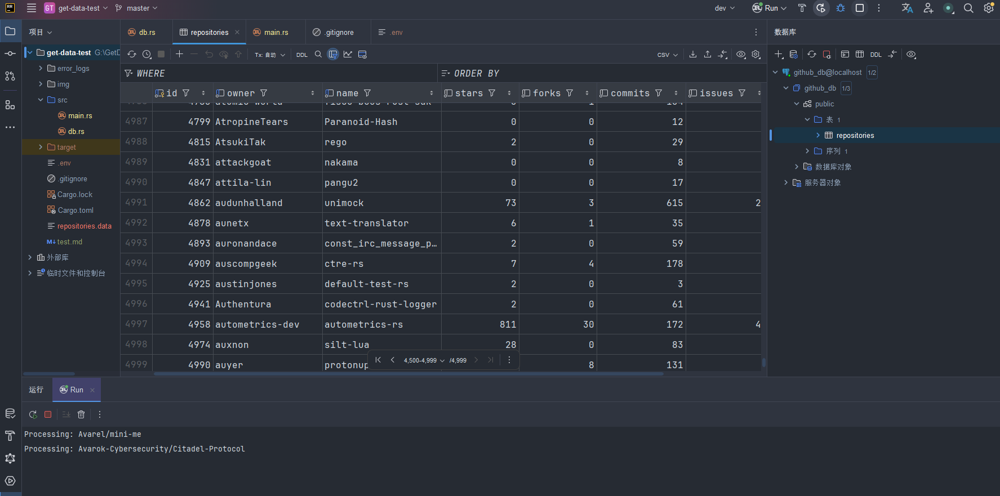
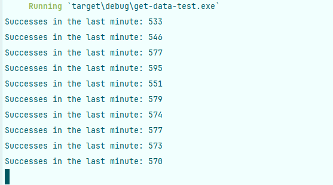

# 1、

3分钟，1403条记录

发生速率限制问题

10.26-----10.35

一小时5000次token（通过个人认证）请求：

* 按照TOKEN计算，不是IP计算：

  后又验证同一个人的两个token同样会发生限制；
* 时间计算：

  1token--10min--5000条

  40000/5000=80
* 并发设计：

  多token 多并发

目标800
